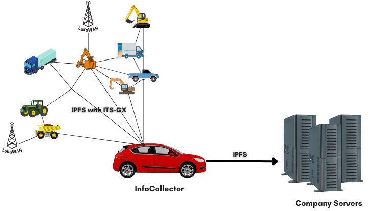

# Fleet Management System

## Description
The project proposes a solution for companies operating fleets of moving vehicles fleets with different routes. Consider the example of a construction company with various worksites in different places or a transportation company with multiple vehicles on overlapping routes. Not all vehicles return to headquarters daily, making fleet monitoring challenging. This problems could be mitigated by using data or cell signal to exchange the information. However, this approach requires constant internet access and subscriptions for network access, as well as servers to process and store the data. Our **concept** is based on ad-hoc communication between the company vehicles, where data is shared between vehicles. When a vehicle reaches the headquarters it reports all his and others gathered data. This enables administrators to access critical information about the entire fleet, such as route made, time that the vehicle spent stationary, consumed fuel, available fuel..., even for vehicles not returning daily. Communication between vehicles and headquarters could also be based in the same communication technology.

-----
## Goals
- **Decentralization**:
	* Eliminate the need for constant internet connection.
	* Shift away from centralized data management systems.

- **Data Accessibility**:
	* Provide users with relevant information on-demand.
	* Focus on end-of-day, weekly, or monthly insights rather than real-time tracking.

* **Data Ownership:**
	* Data can be stored on-premises, or in the cloud, but administered by the company, without the need for intermediaries.
 
- **Enhanced Metrics**:
	* Monitor driving habits (acceleration, braking ratings, etc.).
	* Track fuel consumption and anomalies (e.g., break-ins).
	* Monitor vehicle trajectory and deviations from assigned paths.
* Capture additional metrics like driver attention and breaks.

- **Efficient Communication**:
	* Facilitate communication between vehicles within the fleet.
	* Implement ITS-G5 with IFPS or similar ad-hoc protocols for inter-vehicle communication and data offloading based on routes.
		* Prioritize data offloading between vehicles based on return time to headquarters or company sites.
----
## Implementation/ Demonstration details
* We're planning to be able to implement the system physically, possibly with just the next components
	* at least two/three Raspberry Pis or similar (due to the network card needed)
	* Two/three LoRa 868 Mhz modules
----
## Possible additions
- **Security Measures**:
  - Implement robust encryption techniques to secure data transmission.
  - Authenticate device connections using challenge-based authentication.
  - Utilize public-private key pairs with certificates signed by the company to prevent man-in-the-middle attacks and ensure authentic connections.
* **Real-time monitoring:**
 * Our system can be improved by connecting to the existing LoRaWAN or The Things Network, so that the company could have access to some real-time information or critical data
---
## Related projects:
* Gps tracker [car tracker ionic](https://github.com/tentone/car-tracker-ionic?tab=readme-ov-file)
* Gps tracker [traccar github](https://github.com/traccar/traccar), [traccar site](https://www.traccar.org/), [traccar docker](https://github.com/traccar/traccar-docker#readme)
* Base dados distribuída [OrbitDB](https://github.com/orbitdb/orbitdb?tab=readme-ov-file)
* Usar [ebtables](https://linux.die.net/man/8/ebtables) no simulador
* Gps packet format [guide](https://www.redhat.com/architect/architects-guide-gps-and-gps-data-formats)
* GPX file format [guide](https://hikingguy.com/how-to-hike/what-is-a-gpx-file/)
* Cool GPS path Track animation [repository](https://github.com/JoanMartin/trackanimation)